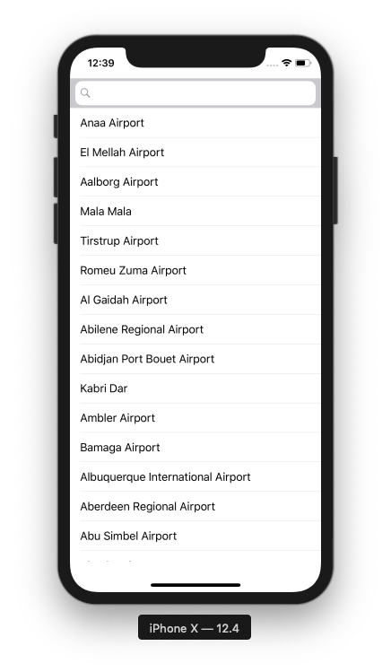
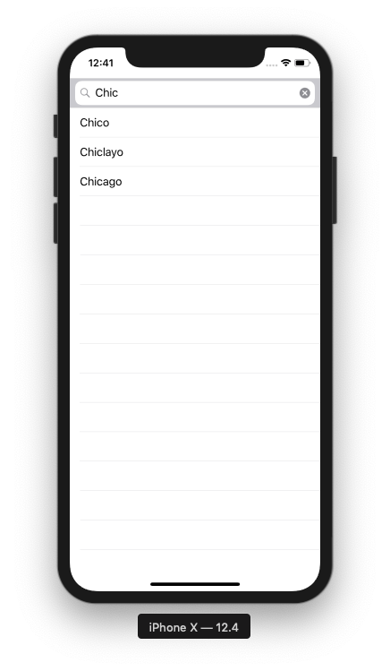
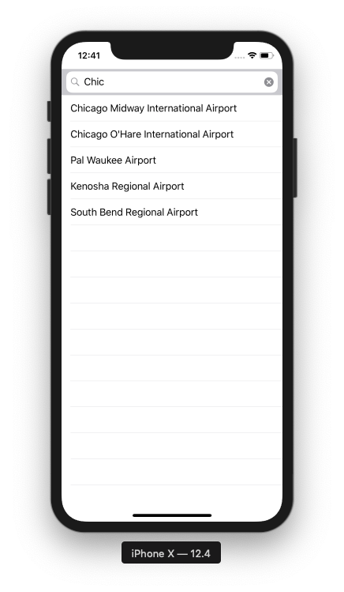
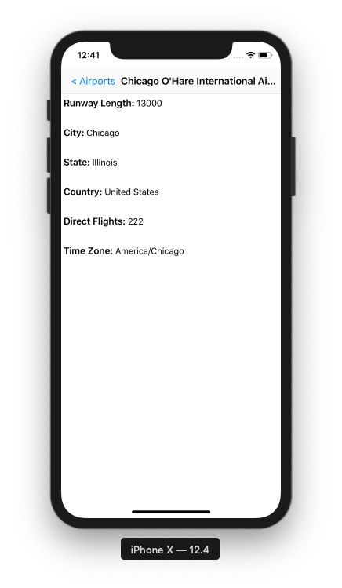
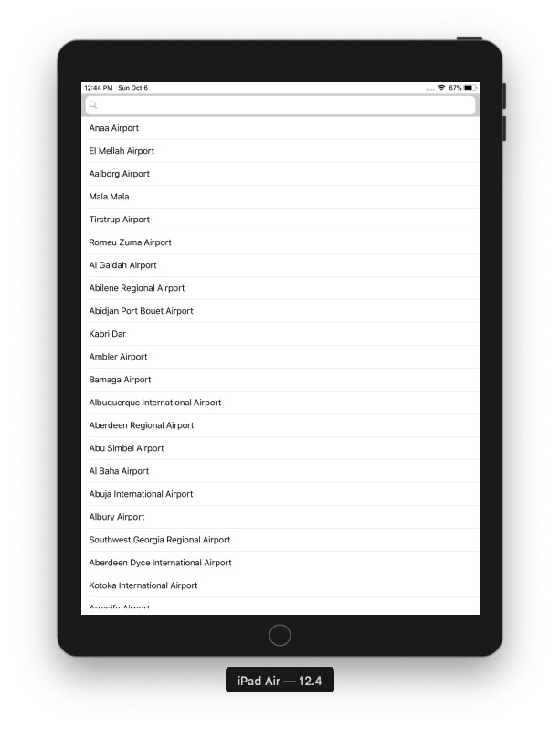
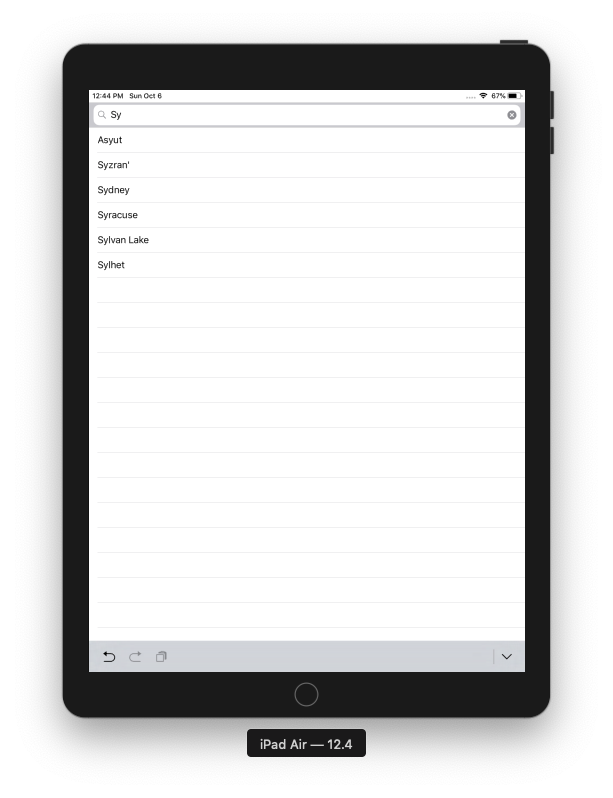
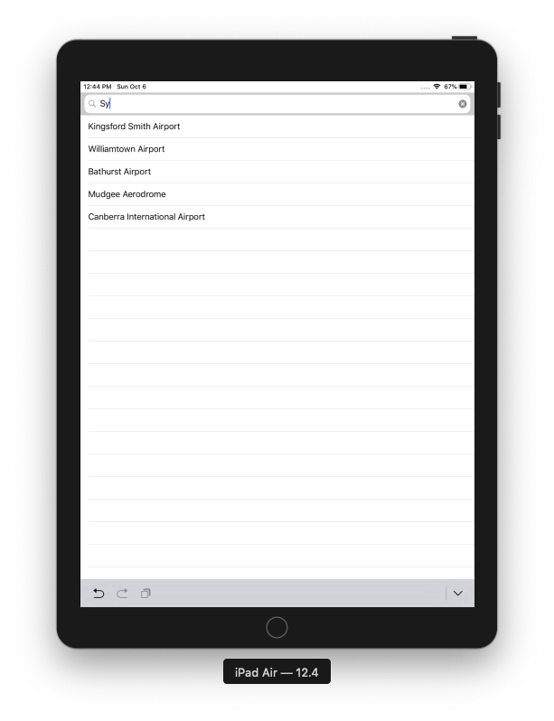
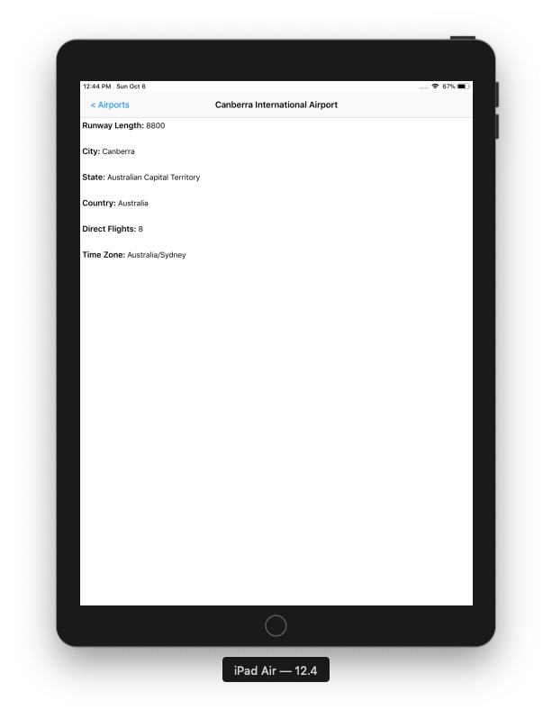

# Airport Finder

<b>Technology Stack:</b> 
 XCode version: 10.3 
 Swift version: 5.0 
 Architecture Pattern : Model View ViewModel(MVVM) 
 Design Pattern : Decorator 
 UI Design: Storyboard and Autolayout 
 Unit Testing framework: Quick and Nimble 
 UI Testing framework: XCTest 
 Dependency Manager: Cocoapod 
 <b>Thirdparty Library:</b> 
    SwiftLint: To enforce swift style and conventions 
    PromiseKit: To communicate githubusercontent server 
  
 <b>Screenshots: iPhone</b> 

<b>Screenshots: iPad</b> 

